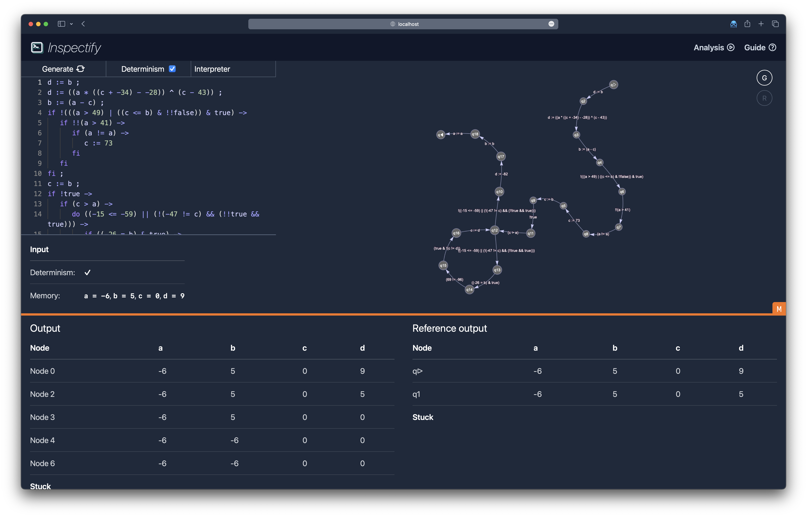

# Inspectify



## Development

Inspectify is a [React](https://reactjs.org/) application for the user-interface written in TypeScript, which uses the `checko` crate compiled to [WebAssembly](https://webassembly.org/), and finally a backend to run locally as well. Thus, it is required to have tools for all environments.

### Requirements

To build inspectify locally the following tools are required:

- [Rust](https://www.rust-lang.org/): Install using [rustup](https://rustup.rs).
- [Just](https://github.com/casey/just/): Install using `cargo install just` or with [`cargo-binstall`](https://github.com/cargo-bins/cargo-binstall) using `cargo binstall just`.
- [Typeshare](https://github.com/1Password/typeshare): Install using `cargo install typeshare-cli` or with [`cargo-binstall`](https://github.com/cargo-bins/cargo-binstall) using `cargo binstall typeshare-cli`.
- [cargo watch](https://github.com/watchexec/cargo-watch): Install using `cargo install cargo-watch` or with [`cargo-binstall`](https://github.com/cargo-bins/cargo-binstall) using `cargo binstall cargo-watch`.
- [NodeJS](https://nodejs.org/en/): Install in the best way you see fit, but I can recommend [Volta](https://volta.sh/) on macOS and Linux, and `winget install OpenJS.NodeJS` on Windows :)

On a unix system, the following commands should get you up to speed:

```bash
curl --proto '=https' --tlsv1.2 -sSf https://sh.rustup.rs | sh
cargo install cargo-binstall
cargo binstall just typeshare-cli
curl https://get.volta.sh | bash
volta install node
```

### A note on development Windows

The development scripts all use shell, and thus you need to have a shell installed. The most common ways are to use [Git Bash](https://git-scm.com/downloads) or [WSL](https://learn.microsoft.com/en-us/windows/wsl/install). If choose you use WSL then you should remember to run everything inside of that. If you choose to use Git Bash, then you need to install it, and make sure that `C:\Program Files\Git\bin` is in your `PATH` variable. If it isn't then add it to your `PATH` variable and restart you Windows, just to be sure. Once this is done, if it was successful, the following command `sh --version` should work in PowerShell and print your shell version. From this point on, you should use either a PowerShell command line or Git Bash.

### Building during development

There are two main things that must be build: The frontend UI, and inspectify the backend.

During development, you often want all the pieces to be recompiled on changes, and the `Justfile` contains what you need for this to happen. As there are two parts, it is often beneficial to run the build in three terminals.

```bash
# watch for changes in the frontend code and rebuild when needed
just watch-web

# build and serve the backend code
just watch-inspectify
```

Now the two servers should be running. On [localhost:3001](http://localhost:3001/) you should find the frontend hosted by [Vite](https://vitejs.dev/) that live updates on any changes. On [localhost:3000](http://localhost:3000/) the backend is running, which shows a static version of the frontend at the time of building, but it also responds to queries about the external implementations. You should primarily using [localhost:3001](http://localhost:3001/) during development!

### Building for production

Building the two components for production is automated in the `Justfile`! So all you need is to run the following command:

```bash
just build-inspectify
```
